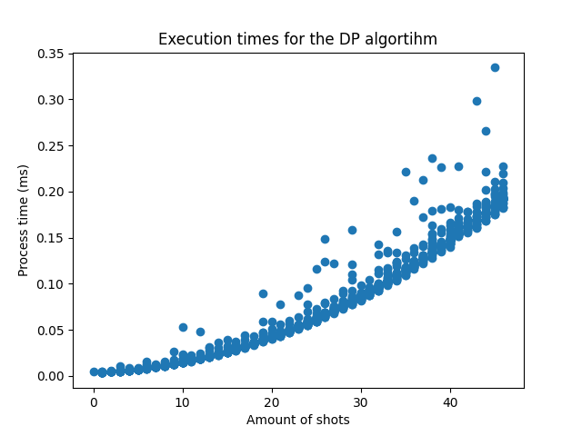
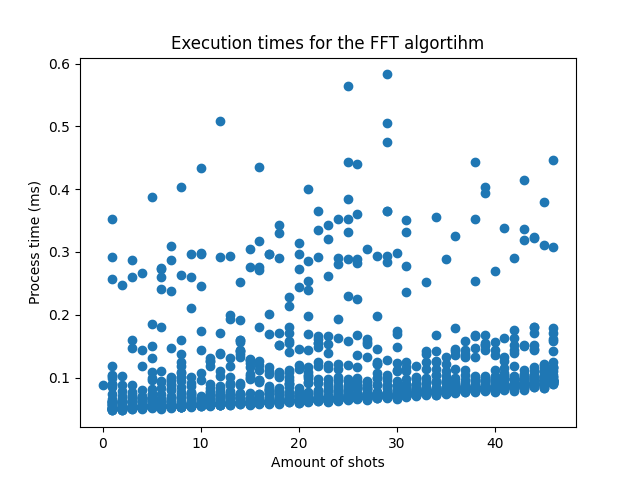
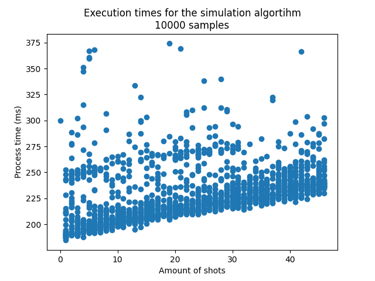

# Bachelor's Thesis
## xG Values
### Sources
Statsbomb and Understat both provide xG values free for non-commercial use. 
To assess what the better source for the xG values is we have to look at xG values for shots/matches which are represented in both sources.
**Understat indexed competitions**
Understat indexes 6 different leagues:
- Premier League
- La Liga
- Bundesliga
- Serie A
- Ligue 1
- RFPL

**Intersection of Understat and Statsbomb**
Looking at the [competitions which are indexed by statsbomb open data](https://github.com/statsbomb/open-data/blob/master/data/competitions.json) we can make out the competitions which are indexed by both data providers:
- Premier League
    - Season 2015/16
- La Liga
    - Season 2014/15
    - Season 2015/16
    - Season 2016/17
    - Season 2017/18
    - Season 2018/19
    - Season 2019/20
    - Season 2020/21
- Bundesliga
    - Season 2015/16
- Serie A
    - Season 2015/16
- Ligue 1
    - Season 2015/16

Statsbomb only indexes a very small subset of La Liga.

### xG Distribution of Statsbomb and Understat
When looking at the distribution of the xG values of the 1. Bundesliga 2015/2016 we can clearly see the difference of the data providers regarding the xG values.

A couple of differences can be spotted:
- Different amounts of shots
    - For a shot it might happen, that one data provider classifies it as a shot and the other data provider does not classify it as a shot. This can have many reasons why it happens:
        - Difference in measurement systems
        - Difference in what classifies as a shot within the measurement system
        - Other reasons, like technical inaccuracies, failure of equipment, etc.
- Peak in xG's at roughly around 0.75
    - Most dataproviders fix the xG values for penalty shots, as these shots within their measurement systems always have the same conditions for any shooter/goalkeeper pair. Important to note here, is that we can see that Statsbomb fixes the penalty xG value above 0.75, while Understat fixes it at just under 0.75.
- Shape of the distribution
    - Statsbomb's distribution of xG seems smoother and the exponential decay is more pronounced. Except for penalties the absolute frequency is inverse proportional to the xG.
    - Understat's distribution has more ragged edges. The inverse proportional relationship of the absolute frequencies of shots to the xG value does not exist anymore, as there are less shots between the xG values 0.2 and 0.25 , than between the xG values 0.25 and 0.5.

**xG Distribution of all intersecting seasons combined**

Looking at the xG distribution of all seasons, which are in the Statsbomb dataset ***and*** in the Understat dataset, we can see, that these difference in distribution become even more pronounced:
Statsbomb distribution gets smoothed out even more, with a single-valued peak at just above 0.75 xG that represents the penalty shots, while Understats distribution looks almost like a triangle in the lower range of xG. Understat's distribution now also showcases the distribution between the xG values 0.2 and 0.7 as almost symmmetrical and it also seems to have multiple values for the peak at around xG value 0.75.
Furthermore, Statsbomb indexes 161 more shots, which is about 0.44% more than Understat.

Here are some more metrics of the above plotted distributions:
- Statsbomb mean xG: 0.0984384322742285
- Understat mean xG: 0.1036390906000399
- Statsbomb median xG: 0.050603875
- Understat median xG: 0.0477632656693458
- Statsbomb variance xG: 0.019729970692841086
- Understat variance xG: 0.024090796686108872
- Statsbomb standard deviation xG: 0.14046341407228105
- Understat standard deviation xG: 0.15521210225400878

## Algorithms
### Calculating the Distribution
**Dynamic Programming**

The DP (Dynamic Programming) algorithm's execution times show a general increasing trend with the number of shots. This suggests a correlation between the complexity of the input (in terms of shots) and the time taken to process it. We can also see, that there is not alot of variance between the measurements. Reason for that is that there really isn't a 'worst-case' for dynamic programming.

**FFT Algorithm**

The FFT (Fast Fourier Transform) algorithm scatter plot indicates a group of outliers where the execution time is significantly higher than the average. This could point to occasional performance degradations possibly due to algorithmic inefficiencies. The variance between the execution times is high and when summing the probabilities there is some error displayed.

### Simulation
Looking at the sources of the [website](https://danny.page/expected_goals) made by Danny Page, which simulates matches to get the frequentistic probability of the goal distribution, the source for the function generating the samples, samples the match 10000 (ten-thousand) times. Taking this number to generate a represantitive sample of the distribution the running times of the simulation are plotted. Of course, to make out if 10000 samples is enough, there is further analysis needed.

For the simulation algorithm, the execution times are quite varied but do not show a clear trend with the number of shots. The spread of execution times suggests that the algorithm's performance may be influenced by factors other than just the input size. Namely it is heavily dependant on the number of simulations of the match to be run.

# Tasks
Contact understat on their data source (event data?) (+)
Look into which matches have the biggest difference of shots
Distribution of shots per match (+)
Two providers for the same pipeline (that it is applicable to any data provider) (+)
Scale the pipeline out (+)
Linear regression on runtimes
Heating up cache? (-)
Write about numerical instability (+-)
look at danny.page, how many times they simulate for a representative sample (+)
Plot execution times from algorithms, given the distribution from the matches (+)
# Next meeting
bernmix issue, delayed
fix the seed -> reproducability
different cells for different algorithms
Python for the algortihms and plotting execution time
streamlit.io dashboard

# Important links
- Used python package: https://github.com/tsakim/poibin

aggregate running time 1s
look into ways to compare simulation with exact algorithms (assess the precision (distribution of the simulation))
determine N to achieve good level of accuracy (r.o.t max.dist 1/2 min of probabilities)
sampling xg distribution to observe difference in computation times.
NaN xg value non-existent in statsbomb
precision of the algorithms
comparison between shot sequences > sort decreasing/increasing/(|p - 1/2|) > look on outcome of numerical stability
writing > 1. descriptives of the data  > 2. bibliography > 3. description of the algorithms > 4. Design of experiment (sequence of things that are tested and how they are reported) 

experiment: design > data > presentation > discussion

pseudocode in the main text > appendix holds main code source (python)

report attempts at making the dp algorithm faster (at the end of the comparative assessment)

((does this still hold in the c interface))

descriptive statistics:
distribution of xG values
how many shots per team
interaction effect
sum of the teams more consistent than shots per team

difference of original xG distribution and rounded xG distribution (understat)

more than 4 digits of precision in outcome probability * points

not fixing the seed when sampling > ensure frequentistic consistent results > fix seed at the end (reproducability)

(+) add supervisors to the overleaf document

