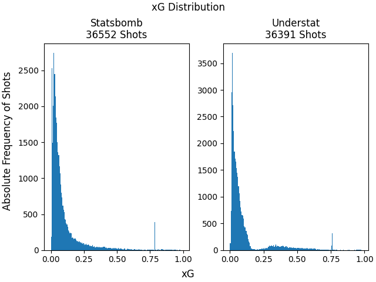

# Bachelor's Thesis
## xG Values
### Sources
Statsbomb and Understat both provide xG values free for non-commercial use. 
To assess what the better source for the xG values is we have to look at xG values for shots/matches which are represented in both sources.
**Understat indexed competitions**
Understat indexes 6 different leagues:
- Premier League
- La Liga
- Bundesliga
- Serie A
- Ligue 1
- RFPL

**Intersection of Understat and Statsbomb**
Looking at the [competitions which are indexed by statsbomb open data](https://github.com/statsbomb/open-data/blob/master/data/competitions.json) we can make out the competitions which are indexed by both data providers:
- Premier League
    - Season 2015/16
- La Liga
    - Season 2014/15
    - Season 2015/16
    - Season 2016/17
    - Season 2017/18
    - Season 2018/19
    - Season 2019/20
    - Season 2020/21
- Bundesliga
    - Season 2015/16
- Serie A
    - Season 2015/16
- Ligue 1
    - Season 2015/16

Statsbomb only indexes a very small subset of La Liga.

### xG Distribution of Statsbomb and Understat
When looking at the distribution of the xG values of the 1. Bundesliga 2015/2016 we can clearly see the difference of the data providers regarding the xG values.

A couple of differences can be spotted:
- Different amounts of shots
    - For a shot it might happen, that one data provider classifies it as a shot and the other data provider does not classify it as a shot. This can have many reasons why it happens:
        - Difference in measurement systems
        - Difference in what classifies as a shot within the measurement system
        - Other reasons, like technical inaccuracies, failure of equipment, etc.
- Peak in xG's at roughly around 0.75
    - Most dataproviders fix the xG values for penalty shots, as these shots within their measurement systems always have the same conditions for any shooter/goalkeeper pair. Important to note here, is that we can see that Statsbomb fixes the penalty xG value above 0.75, while Understat fixes it at just under 0.75.
- Shape of the distribution
    - Statsbomb's distribution of xG seems smoother and the exponential decay is more pronounced. Except for penalties the absolute frequency is inverse proportional to the xG.
    - Understat's distribution has more ragged edges. The inverse proportional relationship of the absolute frequencies of shots to the xG value does not exist anymore, as there are less shots between the xG values 0.2 and 0.25 , than between the xG values 0.25 and 0.5.

**xG Distribution of all intersecting seasons combined**

Looking at the xG distribution of all seasons, which are in the Statsbomb dataset ***and*** in the Understat dataset, we can see, that these difference in distribution become even more pronounced:
Statsbomb distribution gets smoothed out even more, with a single-valued peak at just above 0.75 xG that represents the penalty shots, while Understats distribution looks almost like a triangle in the lower range of xG. Understat's distribution now also showcases the distribution between the xG values 0.2 and 0.7 as almost symmmetrical and it also seems to have multiple values for the peak at around xG value 0.75.
Furthermore, Statsbomb indexes 161 more shots, which is about 0.44% more than Understat.

Here are some more metrics of the above plotted distributions:
- Statsbomb mean xG: 0.0984384322742285
- Understat mean xG: 0.1036390906000399
- Statsbomb median xG: 0.050603875
- Understat median xG: 0.0477632656693458
- Statsbomb variance xG: 0.019729970692841086
- Understat variance xG: 0.024090796686108872
- Statsbomb standard deviation xG: 0.14046341407228105
- Understat standard deviation xG: 0.15521210225400878